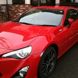
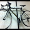

## メンバー紹介

#### あつみん / [@atsumin](https://twitter.com/atsumin)

ソースコード解析のスペシャリストにしてcodefirstのトップ。ラーメン大好き。
週に一回は本郷亭に通っている。ちぢれ麺のように複雑に絡み合ったソースコードを、
ときほぐすためのツールをいくつも開発している。しかし本郷亭の麺はストレートである。
実はまだ本気を出していない。

好きなエディタ: Emacs / 好きなブラウザ: Firefox / 好きなOS: FreeBSD

#### すえつぐ / [@suer](https://twitter.com/suer)

最速さん。codefirst プロダクトのプロトタイプ開発全般を担当する。
作りはじめてから動くものが出来るまでが異常に速い。
ただし、本当に速いのは作り始めてから飽きるまでの時間だという説もある。
([個人ブログ](https://atsum.in))

好きなエディタ: 秀丸 / 好きなブラウザ: InternetExplorer 6.0 / 好きなOS: Windows XP

#### みずぴー / [@mzp](https://twitter.com/mzp)

suer が飽きた後のプロダクトをリリースレベルまで持っていく際の実装を担当する。
驚異的スピードで実装を進める。
private なチャットを Twitter に流すスピードも驚異的なため、
codefirst 内の行動には気をつけなければいけない。

好きなエディタ: Emacs / 好きなブラウザ: w3m / 好きなOS: Debian

#### まろぶ / [@mallowlabs](https://twitter.com/mallowlabs)

タンポポさん。suer &amp; mzp が勢いで作ったプロダクトの自動ビルド環境や README の記述、
CSS の調整、ロゴの作成、ノウハウの文書化など、
タンポポを刺身に乗せるような仕事を担当する。
codefirst のプロダクトアイデアの大半は彼の妄想が元である。

好きなエディタ: Vim / 好きなブラウザ: Google Chrome(dev channel) / 好きなOS: Ubuntu

#### しもむら / [@shimomura1004](https://twitter.com/shimomura1004)

しもきんすさん。suer &amp; mzp が勢いで作った挙句、放置されたバグの修正を担当する。
また、知らぬ間に素敵機能が増えている時は、しもむらさんの仕業だと思って間違いない。
本業では、Jenkins のおっさんもびっくりするようなビルド作業をこなすため、しもきんすさんと呼ばれている。

好きなエディタ: NTEmacs / 好きなブラウザ: Google Chrome / 好きなOS: Ubuntu

#### ばんじゅん / [@banjun](https://twitter.com/banjun)

ばんじゅんさん。iOS Developer。codefirst のプロダクトの
iPhone/iPad アプリの開発を担当する。「AsakusaSatellite の
iPhone アプリ作ってよ」と mzp に無茶ぶりされた際、
一日で push 通知機能付きのアプリを開発したスーパーハカーである。

好きなエディタ: Xcode / 好きなブラウザ: Webkit,Safari / 好きなOS: OS X

#### どねす / [@rednes](https://twitter.com/rednes)

趣味はサイクリングとビール。
休みの日には数十キロの道のりをサイクリングして過ごすというリア充な面と、
「座椅子 on ベッドは全てがベッドで完結するから最強」
と言い張るひきこもりな面の両面を併せ持つ。

好きなエディタ: ビール / 好きなブラウザ: PSP Vita / 好きなOS: PSP
