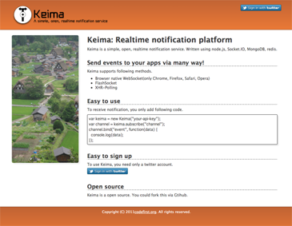
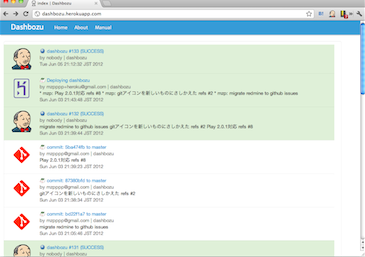

## プロダクト紹介
### Productivity / 生産性の向上
#### [AsakusaSatellite | A realtime chat application for Developers](AsakusaSatellite/)

AsakusaSatellite は、開発者向けのリアルタイムチャットア
プリケーションです。開発者間のコミュニケーション品質を向上
し、ソフトウェア開発にリズムをもたらします。

 1. ![suer]
 1. ![mallowlabs]
 1. ![mzp]
 1. ![shimomura1004]
 1. ![banjun]

#### [QuoteIt | thumbnail/quote boilerplate](quoteit/)

QuoteItは各種Webサービスの埋め込み用HTMLを統一的に取得できるWebAPIです。バックエンドにwedataを採用しているため、誰でも引用元を簡単に追加可能です。

 1. ![mzp]
 1. ![mallowlabs]

#### [Keima | A simple, open, realtime notification service](keima/)

Node.js で書かれた Pusher クローンです。
メッセージングサービスの基盤として使われることを想定して開発されています。

 1. ![mzp]
 1. ![suer]

#### [SnowRabbit | Tweet with the desktop rabbit](SnowRabbit/)

SnowRabbit は OSX 用の Twitter クライアントです。Mac OS X Snow Leopard/Lion で動作します。
following(friend) のグループ化表示ができるので、大勢 follow している人にお勧めです。

 1. ![banjun]

### Quality / 品質の向上

#### [KariyaSiesta | A flexible coding style checker for C](kariyasiesta/)

KariyaSiesta は、C 言語向けのコーディングチェッカ CX-Checker の fork プロジェクトです。コーディング規約はXpathを用いて簡単に拡張できます。

 1. ![mallowlabs]
 1. ![mzp]
 1. ![shimomura1004]

#### [debeso | A snippet stock application for Developers](debeso/)

debeso は、開発者向けのスニペットストックです。開発者間の
知識を共有し、知識が行方不明になることを防ぎます。

 1. ![suer]
 1. ![mallowlabs]

### Visibility / 可視化

#### [Dashbozu | A missing line for software development](dashbozu/)

Redmine, git, Jenkins などプロジェクト管理ツールの状態を横断的かつリアルタイムに表示する Web アプリケーションです。
一つの画面でプロジェクトの”今”の状態を把握できます。

 1. ![banjun]
 1. ![shimomura1004]
 1. ![mzp]
 1. ![suer]
 1. ![mallowlabs]

### Chrome Extensions

 * [FastForward for Chrome](https://chrome.google.com/webstore/detail/coddchpngcejbibihffhojggkfdgahkb)
 * [CrossFire for Chrome](https://chrome.google.com/webstore/detail/koagbjdgdmedlijoflccgpiaelepedam)
 * [Jenkins Notifier for Chrome](https://chrome.google.com/webstore/detail/mnjbjjllbclkpnebaddhkoonjelmiekm)

### Redmine Plugins

 * [Redmine Plugins | FIXME OR DIE](http://suer.github.com/)

### Jenkins Plugin

 * [Websocket Plugins](https://wiki.jenkins-ci.org/display/JENKINS/Websocket+Plugin)
 * [Simple Theme Plugin](https://wiki.jenkins-ci.org/display/JENKINS/Simple+Theme+Plugin)
 * [Jenkins Plugin Hub](http://jenkins-plugin-hub.heroku.com/)

[suer]: imgs/icons/suer.png "suer"
[mallowlabs]: imgs/icons/mallowlabs.png "mallowlabs"
[mzp]: imgs/icons/mzp.png "mzp"
[shimomura1004]: imgs/icons/shimomura1004.png "shimomura1004"
[banjun]: imgs/icons/banjun.png "banjun"
