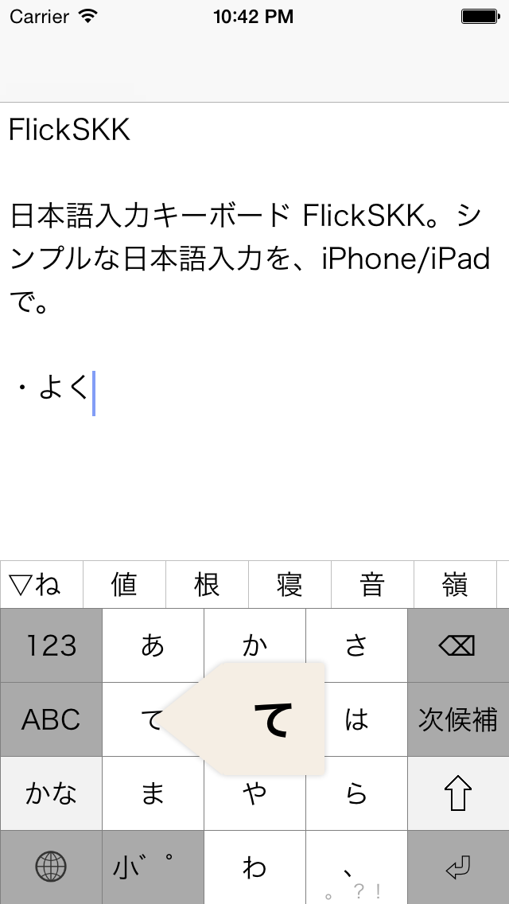
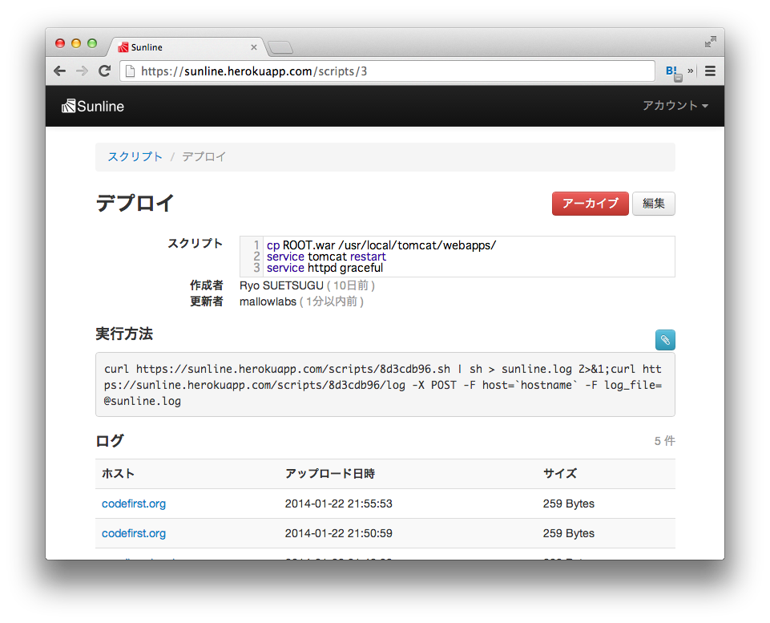

## プロダクト紹介

### Productivity / 生産性の向上

#### [AsakusaSatellite | A realtime chat application for Developers](AsakusaSatellite/)

AsakusaSatellite は、開発者向けのリアルタイムチャットア
プリケーションです。開発者間のコミュニケーション品質を向上
し、ソフトウェア開発にリズムをもたらします。

 1. ![suer]
 1. ![mallowlabs]
 1. ![mzp]
 1. ![shimomura1004]
 1. ![banjun]

#### [QuoteIt | thumbnail/quote boilerplate](quoteit/)

QuoteIt は各種 Web サービスの埋め込み用 HTML を統一的に取得できる WebAPI です。

 1. ![mzp]
 1. ![mallowlabs]

#### [Keima | A simple, open, realtime notification service](keima/)

Node.js で書かれた Pusher クローンです。
メッセージングサービスの基盤として使われることを想定して開発されています。

 1. ![mzp]
 1. ![suer]

#### [SnowRabbit | Tweet with the desktop rabbit](SnowRabbit/)

SnowRabbit は OSX 用の Twitter クライアントです。Mac OS X Snow Leopard/Lion で動作します。
following(friend) のグループ化表示ができるので、大勢 follow している人にお勧めです。

 1. ![banjun]

#### [FlickSKK | 手のひらにSKKを](FlickSKK/)

FlickSKKはiOS用のSKK(Simple Kana to Kanji conversion program)です。 SKKの使い勝手をそのままに、iPhoneで使いやすいようにフリック入力に対応しています。

 1. ![banjun]
 2. ![mallowlabs]
 3. ![mzp]

### Quality / 品質の向上

#### [Sunline | A lightweight script and log management tool](sunline/)

Sunline は本番サーバでのスクリプトの実行とログの管理を行うシンプルな Web アプリケーションです。 同様のソフトウェアに Webistrano があります。

 1. ![suer]
 1. ![mallowlabs]

#### [debeso | A snippet stock application for Developers](debeso/)

debeso は、開発者向けのスニペットストックです。開発者間の
知識を共有し、知識が行方不明になることを防ぎます。

 1. ![suer]
 1. ![mallowlabs]

#### [KariyaSiesta | A flexible coding style checker for C](kariyasiesta/)

KariyaSiesta は、C 言語向けのコーディングチェッカ CX-Checker の fork プロジェクトです。コーディング規約はXpathを用いて簡単に拡張できます。

 1. ![mallowlabs]
 1. ![mzp]
 1. ![shimomura1004]

### Visibility / 可視化

#### [Dashbozu | A missing line for software development](dashbozu/)

Redmine, git, Jenkins などプロジェクト管理ツールの状態を横断的かつリアルタイムに表示する Web アプリケーションです。
一つの画面でプロジェクトの”今”の状態を把握できます。

 1. ![banjun]
 1. ![shimomura1004]
 1. ![mzp]
 1. ![suer]
 1. ![mallowlabs]

#### [Hoshi-mi | A Heroku friendly visualization tool](hoshi-mi/)

Hoshi-mi は、Heroku で動作することを重視したデータビジュアライゼーションツールです。 同様のソフトウェアに GrowthForecast があります。

 1. ![suer]
 1. ![mallowlabs]
 1. ![mzp]

### Chrome Extensions

 * [FastForward for Chrome](https://chrome.google.com/webstore/detail/coddchpngcejbibihffhojggkfdgahkb)
 * [CrossFire for Chrome](https://chrome.google.com/webstore/detail/koagbjdgdmedlijoflccgpiaelepedam)
 * [Jenkins Notifier for Chrome](https://chrome.google.com/webstore/detail/mnjbjjllbclkpnebaddhkoonjelmiekm)

### Redmine Plugins

 * [Redmine Plugins \| FIXME OR DIE](https://suer.github.io/)

### Jenkins Plugin

 * [Websocket Plugins](https://wiki.jenkins-ci.org/display/JENKINS/Websocket+Plugin)
 * [Simple Theme Plugin](https://wiki.jenkins-ci.org/display/JENKINS/Simple+Theme+Plugin)
 * [Jenkins Plugin Hub](https://jenkins-plugin-hub.herokuapp.com/)

[suer]: imgs/icons/suer.png "suer"
[mallowlabs]: imgs/icons/mallowlabs.png "mallowlabs"
[mzp]: imgs/icons/mzp.png "mzp"
[shimomura1004]: imgs/icons/shimomura1004.png "shimomura1004"
[banjun]: imgs/icons/banjun.png "banjun"
